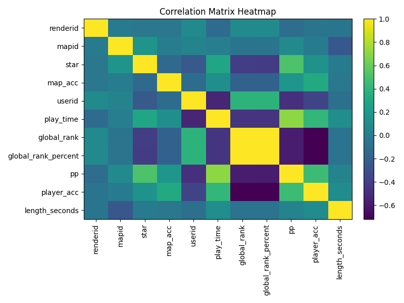
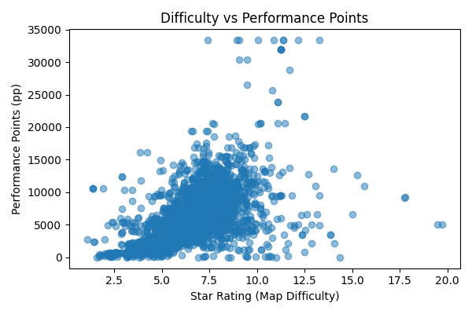
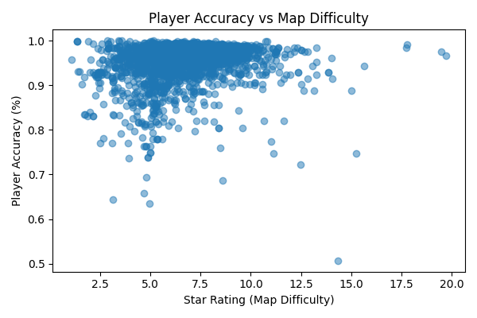
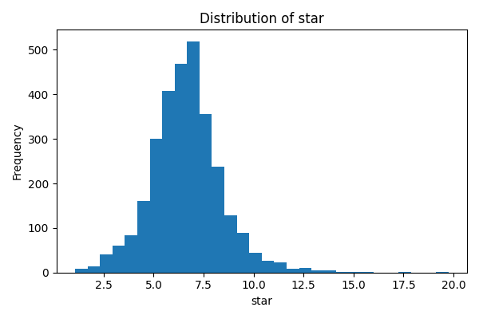
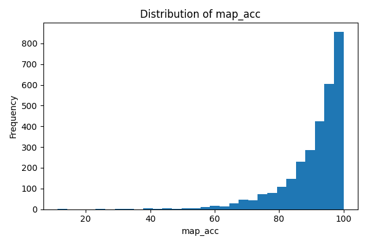
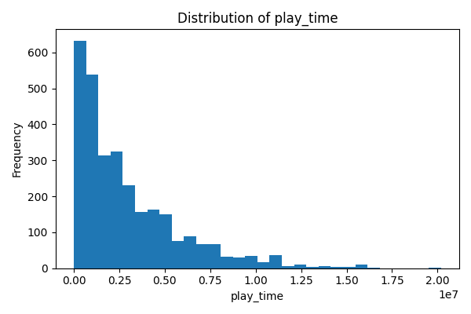
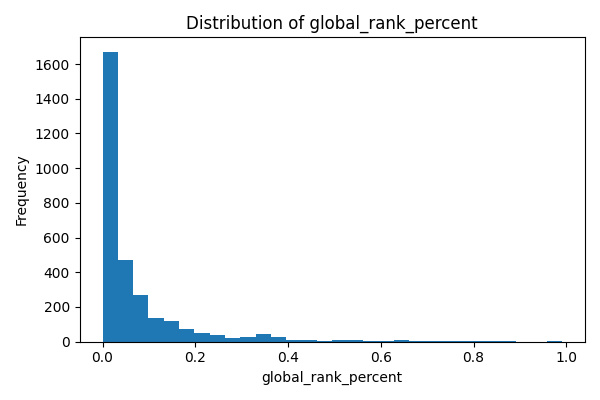
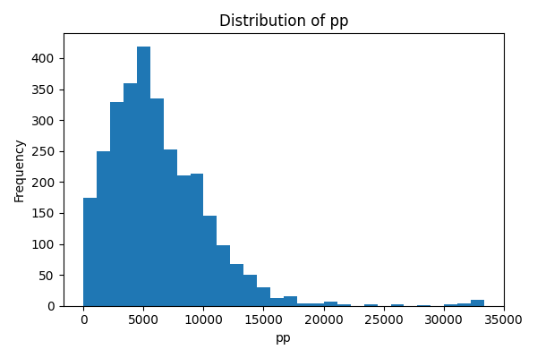
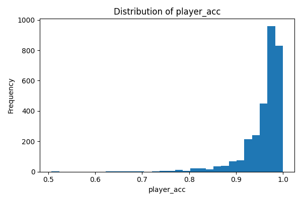
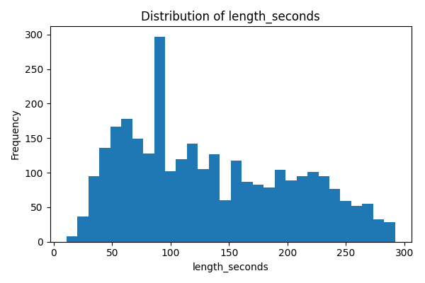

# [osu!3k Dataset](https://www.kaggle.com/datasets/ilymeow/osu3k/)
a dataset of 3000 osu! replays and videos with metadata

## Overview

The **osu!3k** dataset is a curated sample of **3,000** high‑level plays from the rhythm game *osu!* that captures the interaction between beatmap difficulty and player skill. Each row in the dataset represents a single play and includes identifiers for the beatmap and player, beatmap characteristics (length and star rating), gameplay modifications, and detailed performance metrics.

Key facts:

- **Rows:** 3,000 plays
- **Unique players:** 1,767
- **Unique beatmaps:** 2,277
- **Average star rating:** 6.66
- **Average map accuracy:** 90.65 %
- **Average performance points (pp):** 6,239.03
- **Average player accuracy:** 96 %

This dataset is suitable for exploring the relationship between beatmap difficulty and player performance, benchmarking ranking models, and developing recommender systems for beatmaps.

## Dataset Structure

The dataset repository includes the following resources:

- **data.csv** – the primary tabular dataset containing metadata and performance statistics for all 3,000 plays.
- **videos/** – directory containing rendered replay videos.
- **replays/** – directory containing original replay files.

### Synchronized Modalities

Each sample links **video, replay, and metadata** through a shared identifier:

- `/videos/<renderid>.mp4`
- `/replays/<renderid>.osr`
- `data.csv` → `renderid` column

This **1:1 mapping** enables multimodal research tasks such as:

- reconstructing replay inputs from video frames,
- learning visual representations of gameplay,
- combining replay dynamics with player statistics,
- training multimodal machine learning models.

The shared `renderid` key guarantees that each row in `data.csv` corresponds directly to the correct video and replay file.

## Data Collection

The **osu!3k** dataset was assembled using multiple official and community-maintained data sources in late 2024. Each entry represents a single recorded play on a ranked or loved beatmap.

The dataset integrates three synchronized modalities:

1. **Video recordings** of plays sourced from the **official o!rdr API**, which provides rendered replay videos.
2. **Replay files (.osr)** obtained privately with permission from the o!rdr website owner.
3. **Player metadata** collected using the **official osu! API**.

Only **high-confidence submissions** were retained to ensure that performance statistics such as accuracy, rank, and performance points are reliable. The data was curated from a random sequence of o!rdr replays, explining the potential selection bias towards skilled plalyers and high pp plays. As such, it **should not be considered to be a random saple of the player population.**

## Feature Summary

| Column | Description | Type |
|---|---|---|
| renderid | Unique integer identifier for the recorded play. | int |
| map | Beatmap title and difficulty version. | string |
| mapid | Unique identifier of the beatmap. | int |
| length | Beatmap length in minutes:seconds (e.g., `1:45`). | string |
| star | Beatmap difficulty measured by *osu!* star rating. | float |
| mods | Gameplay modifications active during the play (e.g., `HR`, `HDDT`). | string |
| map_acc | Accuracy (%) achieved on the map for this play. | float |
| userid | Unique numeric ID of the player. | int |
| player | Player username. | string |
| join_date | Date the player registered (YYYY‑MM‑DD). | string |
| play_time | Total play time of the player in seconds. | float |
| global_rank | Player’s global ranking at the time of the play. | float |
| global_rank_percent | Player’s percentile rank in the global leaderboard (0–1). | float |
| pp | Performance points awarded for the play. | float |
| player_acc | Player’s overall accuracy across plays (0–1). | float |
| length_seconds | Beatmap length in seconds. | float |

## Statistical Summary

The following table summarizes key numeric features. Percentiles are based on the empirical distribution of the **3,000** plays.

| Metric                        | Min       | Median    | Mean      | Max       |
|------------------------------:|----------:|----------:|----------:|----------:|
| **Star Rating**               | 1.07      | 6.63      | 6.66      | 19.74     |
| **Replay Length (s)**         | 11        | 119.5     | 134.6     | 738       |
| **Performance Points (pp)**   | 2.65      | 5 494     | 6 233     | 33 357.5  |
| **Global Rank Percent**       | 3.3e‑07   | 0.0259    | 0.0679    | 0.991     |
| **Player Accuracy**           | 0.507     | 0.974     | 0.959     | 1.0       |
| **Play Time (s)**             | 244       | 2 041 017 | 2 919 456 | 20 181 378 |
| **Map Accuracy (%)**          | 11.23     | 93.89     | 90.69     | 100.0     |

## Correlation and Interactions

Understanding how features interact helps to design predictive models and insights. The heatmap below illustrates pairwise Pearson correlation coefficients among numeric variables. Strong positive correlations appear between **player accuracy** and **map accuracy**, while global ranking metrics are negatively correlated with performance (lower rank numbers correspond to better players).

### Difficulty vs. Performance

A core question is how beatmap difficulty (star rating) relates to performance. The scatter plot below shows that high performance points (pp) are generally associated with higher star ratings, although extremely difficult maps (★ > 10) are rare.

### Player Skill vs. Map Difficulty

Players with high overall accuracy (≥ 96 %) tend to achieve high accuracy even on maps with star ratings up to 8.5. Accuracy declines and variance increases as difficulty rises.

## Feature Distributions

The following visualizations illustrate the distribution of key gameplay and player features within the dataset.

### Star Rating Distribution

This histogram shows the distribution of **beatmap difficulty (star rating)**. Most plays cluster between **5★ and 8★**, reflecting competitive maps commonly played by experienced players. Extremely high-difficulty maps (>10★) appear rarely but represent the upper skill ceiling.

### Map Accuracy Distribution

This distribution represents the **accuracy achieved on each specific map play**. Because the dataset focuses on leaderboard-level plays, most accuracies fall between **90–100%**, with a heavy concentration near the upper end of the scale.

### Play Time Distribution

The **play_time** feature measures the cumulative playtime of each player in seconds. The distribution reveals a long-tail structure where most players have significant playtime while a smaller group of highly dedicated players exhibit extremely large total playtimes.

### Global Rank Percentile Distribution

This plot shows the **global rank percentile** of players in the dataset. Lower percentile values correspond to higher leaderboard positions. The distribution demonstrates that the dataset is heavily skewed toward **top-ranked competitive players**.

### Performance Points Distribution

Performance Points (**pp**) quantify the quality of each play according to osu!'s ranking algorithm. The distribution highlights the variability of scoring potential across maps and player skill levels.

### Player Accuracy Distribution

This distribution represents the **overall account accuracy of players** across all their plays. Most players in the dataset maintain **very high lifetime accuracy (≥95%)**, consistent with advanced skill levels.

### Beatmap Length Distribution

This histogram shows the **duration of beatmaps** in seconds. Most maps fall within the typical competitive range of **90–240 seconds**, with fewer very short or extremely long maps.

## Usage Notes
- `NM` in the `mods` column corresponds to No Mods used for that play.
- `length` is recored in `mm:ss` or `m:ss` format. The `length_seconds` column has been included to standardize play length,  measured in seconds.
- Accuracy features (`map_acc` and `player_acc`) range from 0 to 100 (percentage) and 0 to 1 respectively; ensure appropriate scaling for modelling.

## Citation

If you use this dataset in academic work, please cite this dataset card as follows:

> [**osu!3k** dataset (2026)](https://github.com/catears124/osu-3k). *A curated sample of 3k high‑level osu! plays for performance analysis and recommendation.*

